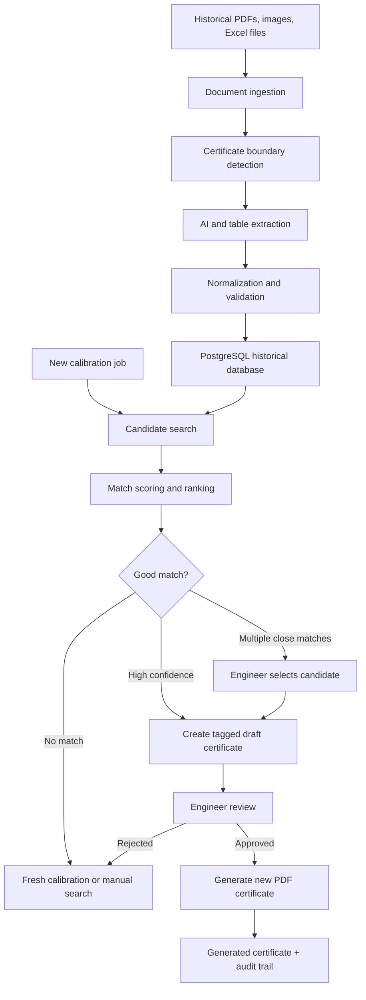
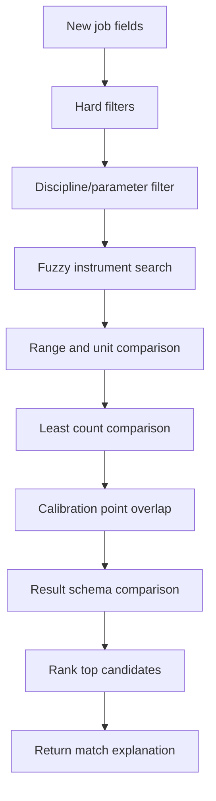
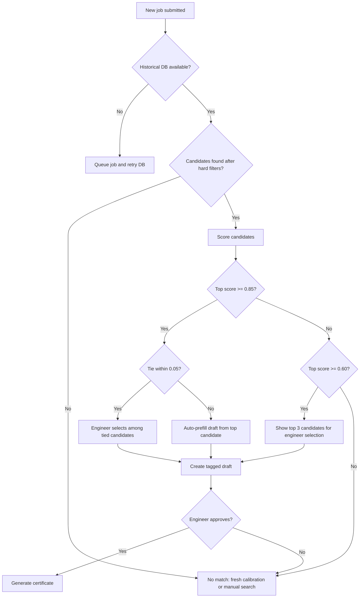
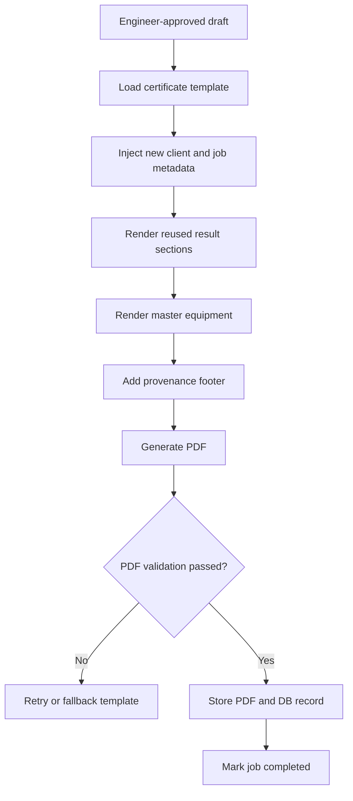
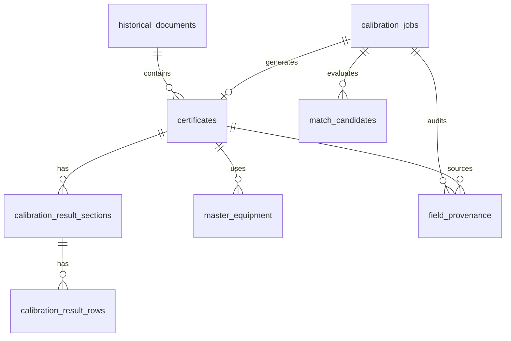

# CalCert Historical Calibration Reuse Automation

## Purpose

CalCert should let an engineer create a new calibration job, match that job against historical certificates, reuse trusted historical calibration values in a draft, and generate a new certificate after engineer review.

The key principle is simple: the system can prefill and reuse data, but it must keep provenance visible. Any value copied from a historical certificate should be tagged as historical, reviewed by an engineer, and stored with an audit trail.

## What The Sample PDF Shows

Sample file inspected:

`/Users/devashishsingh/Desktop/calib cert proj/calib cert documents/AA Electro Magnetic Test Laboratory Private Limited-2.pdf`

Observed structure:

- 32 PDF pages.
- Most pages are separate one-page calibration certificates.
- Page 30 and page 31 are a single two-page certificate with the same ULR: `CC405825000000872F`.
- Each certificate has a repeated header, customer details, UUC identification, environmental conditions, master equipment, calibration results, notes, QR code, and approval areas.
- Calibration result tables vary by discipline and instrument.
- Continuation pages may contain calibration rows without repeating the UUC identification block.

This means the ingestion automation must not assume one PDF equals one certificate, or one page equals one certificate. It must first detect certificate boundaries.

## Core Architecture



## Phase 1: Historical Ingestion

### 1. Document Ingestion

Accept PDFs, scanned PDFs, images, observation sheets, and Excel files from Google Drive or direct upload.

Inputs:

- Source file
- Uploaded by
- Document type hint
- Folder/client metadata if available

Outputs:

- `historical_document_id`
- Source URI
- Page count
- Processing status

Validation:

- File is readable.
- Checksum is unique.
- PDF page count is available.

### 2. Certificate Boundary Detection

Detect logical certificate groups before extraction.

For the sample PDF, the correct grouping is mostly one page per ULR, except the Digital Multimeter certificate where page 30 and page 31 share `CC405825000000872F`.

Boundary signals:

- `Certificate/ULR No.`
- `Page X of Y`
- Repeated title: `Calibration Certificate`
- First page UUC identification block
- Continuation pages with same ULR

Output example:

```json
{
  "certificate_ulr_no": "CC405825000000872F",
  "source_page_start": 30,
  "source_page_end": 31,
  "page_count": 2
}
```

### 3. Extraction

Extract all reusable fields into structured JSON.

Recommended extraction strategy:

- Use deterministic PDF text/table extraction where the PDF has selectable text.
- Use Gemini multimodal extraction for scanned pages, broken tables, or ambiguous layouts.
- Keep both raw values and normalized values.

Required extracted groups:

- Certificate metadata
- Customer details
- UUC identification
- Environmental conditions
- Calibration reference standard
- Calibration procedure
- Master equipment used
- Calibration result sections
- Calibration result rows
- Notes
- Source page span

### 4. Normalization And Validation

Normalize fields without destroying original text.

Examples:

- `24+-2 degC` into temperature mean and tolerance.
- `0 to 15 KN` into lower bound, upper bound, unit, and raw text.
- `As per Range` stays valid raw text but receives a lower numeric-match score.
- `Page 2 of 2` links to the prior page with the same ULR.

Validation rules:

- ULR is required.
- Instrument name is required on the first page.
- Parameter/discipline is required.
- At least one result row is required for automatic reuse.
- Every copied result row must preserve raw row JSON.

## Phase 2: New Job Automation

### User Input

The engineer creates a new job with:

- Client name and address
- Instrument name
- Instrument type
- Discipline/parameter
- Manufacturer
- Model
- Serial number
- Range
- Least count
- Requested calibration points if known
- Job number

The backend saves this as `calibration_jobs.status = pending_match`.

### Candidate Search

The backend searches historical certificates using a layered approach.



Hard filters:

- Discipline/parameter, where available.
- Exclude records marked bad quality.
- Exclude generated certificates when the user wants only lab-tested history, unless explicitly allowed.

Candidate retrieval:

- PostgreSQL `pg_trgm` for fuzzy text search.
- RapidFuzz for token-based scoring.
- Optional pgvector for semantic synonyms later.

### Similarity Score

Recommended weighted score:

| Attribute | Weight | Method |
| --- | ---: | --- |
| Instrument name | 0.25 | Token fuzzy match |
| Discipline/parameter | 0.20 | Exact or synonym match |
| Range | 0.15 | Numeric/unit overlap |
| Least count | 0.10 | Normalized text/numeric match |
| Manufacturer/model | 0.10 | Exact or fuzzy match |
| Calibration points | 0.10 | Overlap of requested vs historical points |
| Result table schema | 0.05 | Same measurement sections and columns |
| Historical quality | 0.05 | Extraction quality and completeness |

Confidence tiers:

- `HIGH`: score >= 0.85
- `MEDIUM`: 0.60 <= score < 0.85
- `LOW`: score < 0.60

Tie rule:

- If two candidates are within `0.05`, do not auto-select.
- Show both to the engineer.
- Use most recent calibration date only as a tiebreaker after engineer visibility.

### Candidate Explanation

Every match should show:

- Total confidence score
- Score tier
- Matching fields
- Weak fields
- Missing fields
- Quality warnings
- Source ULR and calibration date
- Result sections available for reuse

This is important for trust. Engineers need to see why CalCert chose a historical certificate.

## Decision Tree



## Draft Certificate Rules

The draft combines new job fields and historical fields.

Replace with new job values:

- Client name
- Client address
- Job number
- New certificate number
- Calibration date
- Due date
- Certificate issue date
- Serial number
- Instrument ID if supplied for the new client asset

Reuse from historical dataset:

- Calibration result sections
- Calibration result rows
- Observed values
- Standard values
- Error/correction values
- Uncertainty values
- Environmental conditions
- Master equipment
- Calibration reference standard
- Calibration procedure
- Notes, where allowed by the template

Every reused field must be tagged:

```json
{
  "field_path": "calibration_result_sections[0].rows[2].uncertainty_value",
  "source_type": "historical",
  "source_certificate_ulr_no": "CC205524000002952F",
  "source_page": 1,
  "confidence": 0.91
}
```

## Engineer Review UI

The review screen should be the safety layer.

Recommended UI:

- Left side: matched historical certificate summary.
- Right side: new draft certificate.
- Highlight historical fields.
- Highlight new user-entered fields.
- Highlight auto-generated fields.
- Show confidence score and score breakdown.
- Show alternative candidates.
- Show missing fields requiring fresh measurement.
- Require confirmation checkbox before approval.

Engineer actions:

- Approve draft.
- Edit copied value.
- Switch to another candidate.
- Reject match.
- Send job to fresh calibration.

## Certificate Generation Workflow



Mandatory PDF validation:

- New certificate number appears in PDF text.
- Client name appears in PDF text.
- Instrument name appears in PDF text.
- Calibration result rows are present.
- Audit footer appears.
- Generated file is not empty.

Suggested footer:

> Calibration values marked as historical were retrieved from source certificate `{SOURCE_ULR}` dated `{SOURCE_DATE}`. Reviewed and approved by `{ENGINEER_NAME}` on `{APPROVAL_DATE}`.

## Database Interaction Diagram



## Suggested API Surface

Backend endpoints:

- `POST /api/historical-documents`
- `GET /api/historical-documents/{id}/status`
- `POST /api/jobs`
- `GET /api/jobs/{id}`
- `POST /api/jobs/{id}/match`
- `GET /api/jobs/{id}/candidates`
- `POST /api/jobs/{id}/draft`
- `PATCH /api/jobs/{id}/draft`
- `POST /api/jobs/{id}/approve`
- `POST /api/jobs/{id}/generate-certificate`
- `GET /api/certificates/{id}/download`

## Error Handling

No match:

- Show no suitable historical match.
- Offer fresh calibration.
- Offer relaxed search.
- Offer manual historical selection.

Multiple strong matches:

- Show side-by-side comparison.
- Require engineer selection.
- Never auto-select tied matches.

Database unavailable:

- Save the job.
- Queue matching.
- Retry in the background.
- Show queued status in the UI.

Incomplete historical dataset:

- Prefill available fields.
- Mark missing fields as requires fresh measurement.
- Block approval until required fields are filled or explicitly waived.

PDF generation failure:

- Retry with the selected template.
- Retry with default template.
- Save approved JSON payload for manual generation if rendering still fails.

## Compliance Guardrail

This workflow should be positioned as controlled reuse and draft generation, not silent certificate fabrication.

Important guardrails:

- Do not generate a final certificate without engineer approval.
- Do not hide reused historical values.
- Keep a permanent audit trail for every copied field.
- Store the source certificate ULR and source page range.
- Make the generated certificate wording match the lab's actual SOP and legal obligations.
- If the lab must physically recalibrate to issue a valid certificate, CalCert should generate a prefilled worksheet or draft, not a final certificate.

## Implementation Roadmap

### Milestone 1: Historical Database Readiness

- Add database tables for certificates, result sections, result rows, master equipment, jobs, candidates, and field provenance.
- Add certificate-boundary detection.
- Extract and store the sample PDF into separate certificate records.
- Validate multi-page ULR grouping.

### Milestone 2: Matching Engine

- Implement hard filters.
- Add `pg_trgm` indexes.
- Implement weighted RapidFuzz scoring.
- Return top candidates with score breakdown.
- Add no-match, tied-match, and partial-match handling.

### Milestone 3: Draft Assembly

- Create draft certificate JSON.
- Copy reusable values from selected historical certificate.
- Replace client/job/date/certificate-number values.
- Write field provenance for every value.

### Milestone 4: Review UI

- Build candidate comparison screen.
- Build draft certificate review screen.
- Add edit tracking.
- Add approval workflow.

### Milestone 5: PDF Generation

- Build HTML or ReportLab certificate template.
- Render variable result tables.
- Add audit footer.
- Validate generated PDF.
- Store PDF and mark job complete.

## Future Improvements

- Add pgvector semantic search for instrument synonyms.
- Learn scoring weights from engineer approvals and rejections.
- Build a unit synonym dictionary for mixed units and spellings.
- Add certificate expiry alerts.
- Detect calibration drift over repeated historical records.
- Add bulk job upload from CSV.
- Add ERP API integration.
- Add template editor for labs with different certificate formats.
- Add manual extraction correction UI for low-quality historical records.

